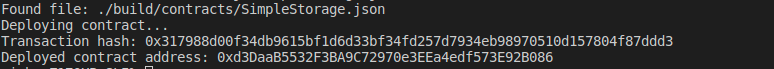

A screenshot of the console output immediately after you have successfully deployed a smart contract.

The transaction hash from the contract deployment (in text format).

0x317988d00f34db9615bf1d6d33bf34fd257d7934eb98970510d157804f87ddd3

The deployed contract address from the contract deployment (in text format).

0xd3DaaB5532F3BA9C72970e3EEa4edf573E92B086