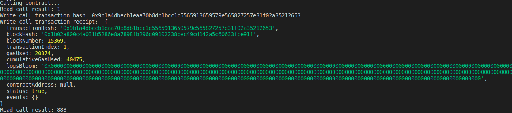

A screenshot of the console output immediately after you have successfully issued a smart contract call.

The transaction hash from the console output (in text format).

0x9b1a4dbecb1eaa70b8db1bcc1c5565913659579e565827257e31f02a35212653

The contract address that you called (in text format).

0xd3DaaB5532F3BA9C72970e3EEa4edf573E92B086

The ABI for contract you made a call on (in text format).

const CONTRACT_ABI = [
    {
      "inputs": [],
      "stateMutability": "payable",
      "type": "constructor"
    },
    {
      "inputs": [
        {
          "internalType": "uint256",
          "name": "x",
          "type": "uint256"
        }
      ],
      "name": "set",
      "outputs": [],
      "stateMutability": "payable",
      "type": "function"
    },
    {
      "inputs": [],
      "name": "get",
      "outputs": [
        {
          "internalType": "uint256",
          "name": "",
          "type": "uint256"
        }
      ],
      "stateMutability": "view",
      "type": "function"
    }
  ];