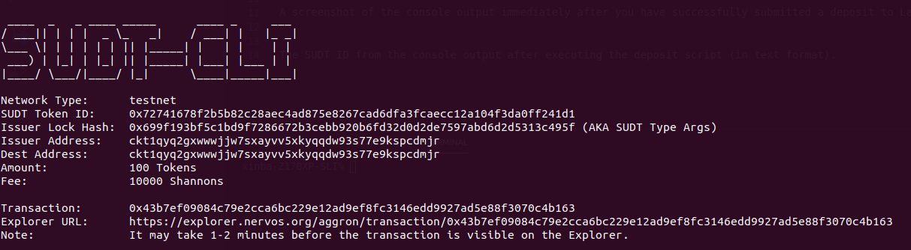
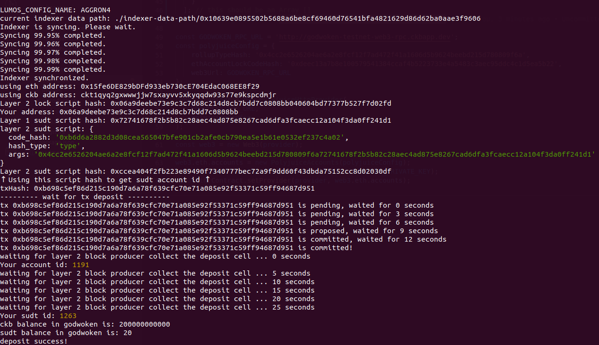

A link to the Layer 1 address you funded on the Testnet Explorer.

https://explorer.nervos.org/aggron/address/ckt1qyq2gxwwwjjw7sxayvv5xkyqqdw93s77e9kspcdmjr

A screenshot of the console output immediately after using sudt-cli to create your SUDT tokens on Layer 1.

A link to the transaction ID created by sudt-cli on the Testnet Explorer.

https://explorer.nervos.org/aggron/transaction/0x43b7ef09084c79e2cca6bc229e12ad9ef8fc3146edd9927ad5e88f3070c4b163

A screenshot of the console output immediately after you have successfully submitted a deposit to Layer 2 using the account-cli tool.

The SUDT ID from the console output after executing the deposit script (in text format).

1263