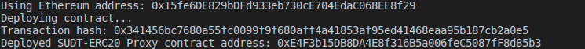
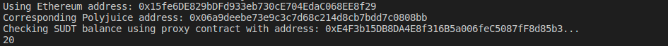

A screenshot of the console output immediately after deploying smart contract.

The address of the ERC20 Proxy Contract you deployed (in text format).

0xE4F3b15DB8DA4E8f316B5a006feC5087fF8d85b3

A screenshot of the console output immediately after checking your SUDT balance.

The Ethereum address that was checked (in text format).

0x15fe6DE829bDFd933eb730cE704EdaC068EE8f29