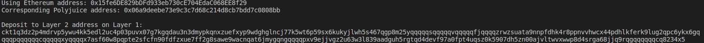

A screenshot of the console output immediately after you have successfully generated your Deposit Receiver Address.

Your Deposit Receiver Address (in text format).

ckt1q3dz2p4mdrvp5ywu4kk5edl2uc4p03puvx07g7kgqdau3n3dmypkqnxzuefxyp9wdghglncj77k5wt6p59sx6kukyjlwh5s467qgp8m25yqqqqqsqqqqqvqqqqqfjqqqqzrwzsuata9nnpfdhk4r8ppnvvhwcx44pdhlkferk9lug2qpc6ykx6gqqqqpqqqqqqcqqqqqxyqqqqx7asf60w8pqpte2sfcfn90fdfzxue7ff2g8sawe9wacnqat6jmygqngqqqqpxv9ejjvgz2u63w3l839aadguh5rgtqd4devf97a0fpt4uqsz0k5907dh5zn00ajvltwvxwwp8d4srga68jjq9rqgqqqqqqcq8234x5

The Ethereum address used to generate the Deposit Receiver Address (in text format).

0x15fe6DE829bDFd933eb730cE704EdaC068EE8f29

A link to the Etherscan explorer for the successful Force Bridge transaction. This can be found on Force Bridge under History→Succeed.

https://rinkeby.etherscan.io/tx/0x83730c94ab02af4f7c8b6582bb526c8a890a7716f988b44ac4381e1aa66e6ed8

A link to the Nervos explorer for the successful Force bridge transaction. This can be found on Force Bridge under History→Succeed.

https://explorer.nervos.org/aggron/transaction/0xa5f91a96851020deb5db0cce4e0b685d17b9e69a78678ab70726681ac367c23e